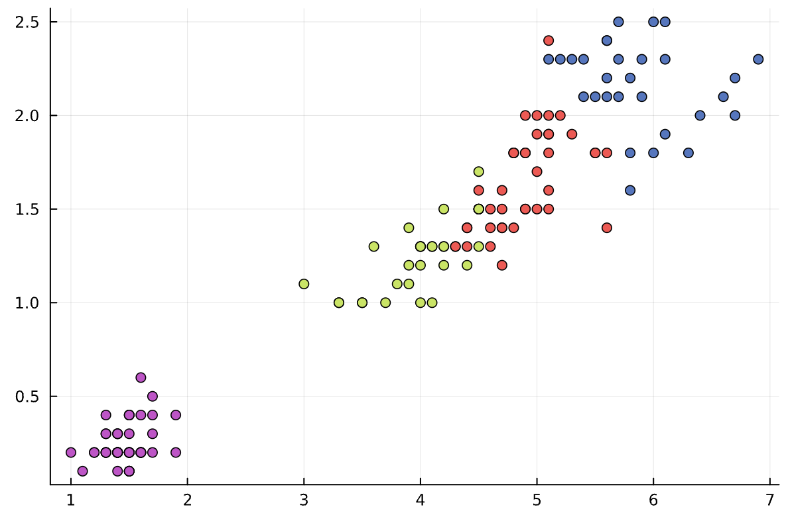

# Jack Montoro's Website

I am glad you are here! Allow me to introduce myself.


I am currently a student at University of California San Diego and an officer in the engineering club Project in a Box. I am full time student, graduating Spring 2023 with a Bachelor's of Science in Math Computer Science, but I am excited to get involved in the industry and develop new skills. I greatly enjoy problem solving, and thrive when I challenge myself to step out of my [comfort zone](https://github.com/jackmontoro/personal_website/blob/main/index.md#personal-interests): academically, professionally and intellectually. 

Outside of my course material, my niche computer science interests are machine learning, data manipulation through Pandas in Google Colab and pathfinding algorithms related to graph theory. Some of my projects can be viewed here:

- **Machine Learning**:

> Link to Project in a Box Presentation/Explanation: [PiB Presentation](https://docs.google.com/presentation/d/179JoC_yrgj0md5ZY4mv-6Z3y68bmQp-VfiTrw7TPuGg/edit?usp=sharing)

> Link to the Colab notebook: [My Colab Notebook](https://colab.research.google.com/drive/10AS6kLALc1kVNHDCh3vZKkz8BK1yoJGS?usp=sharing)

> K-Means Project and code(in Julia) for iris dataset:

```
using Pkg
Pkg.add("CSV")
Pkg.add("Parsers")
Pkg.add("StatsBase")

using DataFrames
using CSV
using Clustering
using Plots
using Statistics

function euclidean_distance(testPt, dataPt)
    dimension = size(testPt,1)
    distance = 0
    for i in 1:dimension
        distance += (testPt[i] - dataPt[i])^(2)
    end
    distance = sqrt(distance)
    return distance
end

iris = CSV.read("iris.csv", DataFrame)

X = select(iris, Not([:Species, :Id]))

petalData = collect(Matrix(X)')

K = 1:10
KM = [kmeans(petalData,k) for k in K]

SSE = zeros(size(KM,1))
for k in 1:size(KM,1)
    for i in 1:size(petalData,2)
        SSE[k] += (euclidean_distance(petalData[:,i], KM[k].centers[:,assignments(KM[k])[i]]))^(2)
    end
end
println(SSE)

plot(K, SSE, legend=false)
title!("SSE by k-Value")
xlabel!("k value")
ylabel!("SSE")
```

[SSEphoto](K-meansSSE.png)

### 2 K-Means Clusters


### 3 K-Means Clusters


### 4 K-Means Clusters



- **App Development**: 

> Link to Project in a Box Presentation: [PiB Presentation](https://docs.google.com/presentation/d/1FLtB7vovW6FB3Obxmra_GUppXkvL0JFj8phRCv65Ebc/edit?usp=sharing)

> Link to Google Drive file with Android Program: [App Source Code](https://drive.google.com/drive/folders/1BD37I6iNENAaSYNYjtLgQVoPFYSYcIJk?usp=sharing)


- **3D Computer Graphics Visual Studio**:
> Will upload soon

## Personal Interests

When I am not studying or working on projects and assignments, I enjoy:
*cooking with my family and trying new cuisines
    -Recently, I made Jamaican oxtail soup for the first time. It is very time-consuming, but wonderfully flavorful and rewarding. Here is the recipe:
        1. Wash your oxtails and clean them with lime.
        2. Grind up your Haitian Epis Green Sauce in a blender(it smells incredible)
        3. Add Green Sauce, green onions, red bell pepper, yellow onion browning sauce, soy sauce, olive oil, worcestishire sauce, salt and pepper,onion powder, garlic powder, ginger, thyme, all spice and one habanero pepper to a bowl with the oxtails. Mix around the ingredients to distribute the flavor.
        4. Marinate the meat with the mix for 2 hours.
        5. Bring a cooking pot-pan hybrid to medium-high heat and add some cooking oil.
        6. Add only the oxtails and cook them on each side until brown.
        7. Add the vegetables and sauce mix.
        8. Add the ketchup, tomato paste and brown sugar. Stir the ingredients around to distribute flavor.
        9. Turn the heat to medium. Cook for about 20 minutes.
        10. Add your beef stock(or water). Turn heat to low-simmer and crack the lid open. Cook for 3-3.5 hours.
        * Original video credit: [Jamaican oxtail stew](https://youtu.be/G6h7QeN5-mI) (come here for the ingredients)           
*taking a walk on the beach and going for a swim
*learning and practicing Portuguese
*reading interesting books about history, philosophy, and political economy

